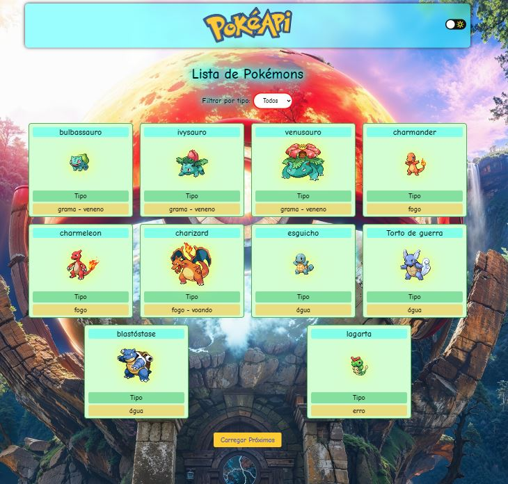
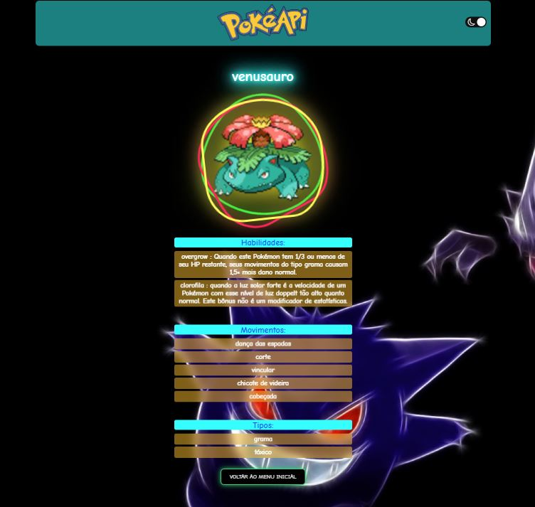
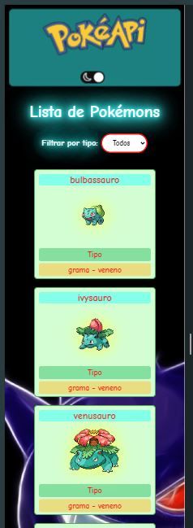

# PROJETO - POKEAPI

## Descrição
Projeto feito para treinar a manipulação de API, proposto pelo curso.

O projeto consiste em uma lista inicial de 10 pokemons, podendo se estender a mas 10 sempre que clicar no botão com essa opção; e conta com um filtro para selecionar por tipo, e ao escolher o pokemon será direcionado para outra página onde mostrará mas detalhe do mesmo.

O projeto tambem conta com  opção de mudar para modo dark e light, mudando também o background-image

## Tecnologia usadas
react router dom
bootstrap-icons

## Difuldades Encontradas
1 - No console estava aparecendo erros com chaves duplicadas (key), sugerindo que, em algum ponto, há Pokémons com o mesmo id (por exemplo, diferentes versões de um mesmo Pokémon)

Pesquisei e descobri que poderia Combinar de id e index do loop como chave. Como o index é único para cada iteração do map, isso garantiu que cada Pokémon tenha uma chave única mesmo que o id seja repetido.

2 - ao chamar os proximos 10 pokemons repetia os da tela inicial,

mais uma vez uma longa pesquisa como sempre, descobri que problema ocorria porque estava acumulando os Pokémons na lista allPokemon toda vez que a função fetchPokemons era chamada, sem verificar se os Pokémons já foram carregados anteriormente, utilizei a função setAllPokemon de forma a garantir que não adicione duplicatas à lista de Pokémons já carregado usando url/id de cada Pokémon .

